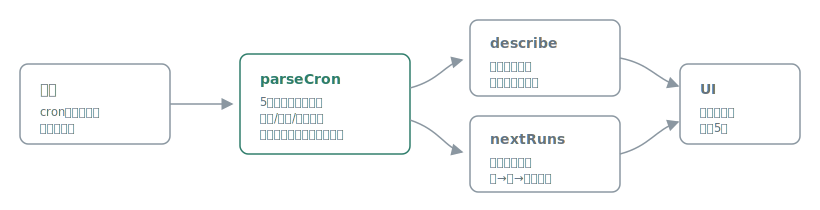

# cronyomi

[](https://github.com/miruky/cronyomi/actions/workflows/ci.yml)
[](https://www.typescriptlang.org/)
[](https://vitest.dev/)
[](https://opensource.org/licenses/MIT)

**cron式を日本語で読み解き、次に実行される時刻をその場で確かめるブラウザツールです。**

## 概要

`30 8 * * 1-5` のようなcron式を入力すると、「平日に8:30 に」という日本語の説明、各フィールドの内訳、そして次に実行される5回の日時を即座に表示します。入力のたびにリアルタイムで更新され、設定ミスにその場で気づけます。パーサ・説明生成・次回時刻計算はすべて自前実装で、外部APIにもサーバーにも依存しません。

遊ぶ: https://miruky.github.io/cronyomi/

### なぜ作ったのか

cron式は書くのは一瞬でも、読み返したときに「これ結局いつ動くんだっけ」と迷います。とくに範囲やステップ、曜日と日の併用が絡むと直感に反する挙動(日と曜日はANDではなくOR)があり、事故のもとになります。書いた式が本当に意図どおりかを、人間の言葉と具体的な実行時刻の両面から確認できる道具がほしくて作りました。

## 使い方

入力欄にcron式を打つか、プリセットのチップを選ぶと、複数の情報が同時に出ます。

- 日本語の説明(例: 「平日に8:30 に」)
- 実行パターン(曜日・時間帯、月指定があれば月を塗り分けた帯)で、いつ動くかを一目で把握
- 5フィールドの内訳(展開後の値)
- 次に実行される時刻(相対表現つき)

対応する記法は次のとおりです。

| 記法           | 例                                                    | 意味                   |
| :------------- | :---------------------------------------------------- | :--------------------- |
| ワイルドカード | `*`                                                   | すべての値             |
| 値             | `30`                                                  | その値のみ             |
| リスト         | `1,15,30`                                             | 列挙した値             |
| 範囲           | `1-5`                                                 | 範囲内すべて           |
| ステップ       | `*/15`, `0-30/10`                                     | 一定間隔               |
| 名前           | `mon-fri`, `jan`                                      | 曜日・月の英名         |
| 別名           | `@daily`, `@hourly`, `@weekly`, `@monthly`, `@yearly` | vixie cronの定型マクロ |

曜日は `0` と `7` のどちらも日曜として扱います。日(第3フィールド)と曜日(第5フィールド)を同時に指定した場合は、cronの仕様どおりどちらか一方に一致すれば実行とみなします。`@reboot` は起動時に動く指定で実行時刻が定まらないため、対象外としてエラーにします。

入力した式はURLのクエリ(`?e=...`)に保存されるため、リンクをそのまま共有・ブックマークできます。式の右肩のボタンでクリップボードにコピーできます。よく使う設定はチップで切り替えられ、現在の式に一致するものは強調表示されます。

## アーキテクチャ



文字列の解釈(`parseCron`)、日本語化(`describe`)、次回時刻の算出(`nextRuns`)を独立した純粋関数として分離し、UIはその結果を描画するだけにしています。ロジックがDOMから切り離されているため、挙動の大半をブラウザなしでテストできます。

## 技術スタック

| カテゴリ   | 技術                 |
| :--------- | :------------------- |
| 言語       | TypeScript 5(strict) |
| ビルド     | Vite                 |
| テスト     | Vitest(60テスト)     |
| リンタ     | ESLint + Prettier    |
| CI / CD    | GitHub Actions       |
| 配信       | GitHub Pages         |
| 実行時依存 | なし                 |

## プロジェクト構成

- `src/cron.ts` — cron式のパーサ。範囲・ステップ・名前・別表記・別名マクロを展開する
- `src/describe.ts` — CronSpecを日本語の説明文に変換する
- `src/next.ts` — 基準時刻から次の実行時刻を算出する
- `src/fingerprint.ts` — 曜日・時・月の活動セルを導く(実行パターンの塗り分け)
- `src/format.ts` — 日時と相対時間の表示整形
- `src/presets.ts` — よく使うスケジュールの雛形
- `src/share.ts` — 式をURLクエリに保存・復元する
- `src/theme.ts` — 配色(自動・ライト・ダーク)の切替
- `src/main.ts` — 入力に連動して描画するUI
- `docs/architecture.svg` — アーキテクチャ図

## はじめ方

### 前提条件

- Node.js 20 以上

### セットアップ

```bash
git clone https://github.com/miruky/cronyomi.git
cd cronyomi
npm install
npm run dev
```

### テストの実行

```bash
npm test
```

### Lintの実行

```bash
npm run lint
```

### デプロイ

`main` ブランチへのプッシュで GitHub Actions がビルドし、GitHub Pages へ配信します。手元での本番ビルドは `npm run build` です。

## 設計方針

- **純粋ロジックの分離** — パース・説明・次回計算をDOM非依存の関数にし、Vitestで網羅的に検証する
- **仕様に忠実** — 日と曜日のOR、曜日の0/7同一視など、vixie cronの挙動に合わせる
- **わかりやすいエラー** — 解釈できない値はどのフィールドが原因かを日本語で示す
- **依存ゼロ** — パーサも時刻計算も自前で持ち、ライブラリの差異に振り回されない

## 制約

秒フィールドや `L`(月末)、`W`(直近平日)、`#`(第n曜日)といったQuartz拡張には対応していません。標準的な5フィールドのcron式を対象としています。

## ライセンス

[MIT](LICENSE)
